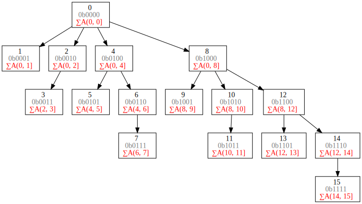

## 0x01 背景
学习的过程，就是领略一代代天才凝结的智慧结晶。TA们的想法是如此的巧妙，就如同世界上最美妙的艺术品一般。今天要介绍的艺术品，叫做[Fenwick Tree](https://en.wikipedia.org/wiki/Fenwick_tree), 它巧妙的结构能让我们在O(logn)的时间内`getPrefixSum(i)`以及`increment(i, inc)`

## 0x02 Prefix Sum
[Prefix sum](https://en.wikipedia.org/wiki/Prefix_sum)指的是数组的前n项和，正常如果获取Prefix Sum的次数很多，最简单的做法就是缓存好每个i的Prefix Sum:
```python
arr    = [1, 2, 3,  4,  5]
prefix = [1, 3, 6, 10, 15]
```
这时`getPrefixSum(i)`的时间复杂度就是O(1), 但如果原数组的内容需要更改的话，`update(i, newVal)`的时间复杂度就是O(n)。这时就需要Fenick Tree出场了。

## 0x03 Fenwick Tree
{{}}

上图中，每个节点都有三行信息:

* 节点第1行：Index信息
* 节点第2行：Index的两进制表示
* 节点第3行：其储存的值

仔细观察，每个root-to-leaf path的node上正好存放了index的prefix sum

### getPrefixSum
比方说，要求数组前7项和，我们要做的就是：
```python
s = 0
index = 7
while index > 0:
    s += tree[index]
    index = parent(index)
```
将 7、6、4、0 节点上的值相加，就可得到前7项和

那么，我们该如何获取父节点的Index呢？仔细观察Index的二进制表示，看你能发现什么：
```
7 = 0b0111
6 = 0b0110
4 = 0b0100
0 = 0b0000
```
将二进制最低位的1置0,就是其父节点的Index

### increment(i)
从图上可以观察到，要更新的话也是有规律的

假设我们要更新节点3, 其受影响的节点就是：3、4、8 (看其存储的值)
对于节点5来说, 其受影响的节点就是：5、6、8

那要怎么获取它们的节点呢？观察一下吧：
```
5 = 0b0101
6 = 0b0110
8 = 0b1000

getNext(5) = 0b0101 + 0b0001 = 0b0110
getNext(6) = 0b0110 + 0b0010 = 0b1000
getNext(8) = 0b1000 + 0b1000 = (out of boud)
```

我们只需要把Index加上其最低位的1即可获得下一个要更新的节点。
如果Index+最低位的1超出了数组的len，就可以停下来了

**是的，就是这么美妙。**

在代码中：
```python
getParent(i):
    i -= (i & -i)

getNext(i):
    i += (i & -i)

把补码写出来，自己算下就知道了，这里就不赘述了。
```