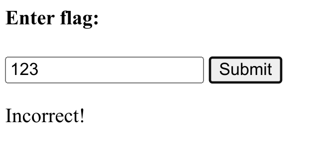
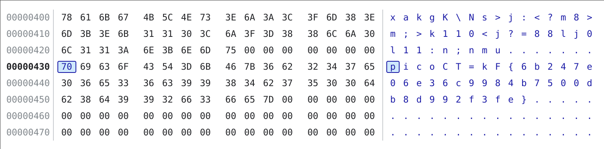

## 有意思的题
最近突然起了兴趣，准备把CTF比赛捡起来。准备从入门级的picoCTF开始刷，今天正好碰到一个[有意思的题目](https://play.picoctf.org/practice?category=1&page=1&search=Some%20Assembly%20Required)，题目需要根据WebAssembly代码找出flag，正好也能熟悉下WebAssembly的语法，特此记录。

## 第一题
打开题目网址，页面很简单，只有一个输入框和按钮，随便输入一串字符，按下Submit，提示Incorrect。

{{}}

查看源码:

```html
<html>
<head>
	<meta charset="UTF-8">
	<script src="G82XCw5CX3.js"></script>
</head>
<body>
	<h4>Enter flag:</h4>
	<input type="text" id="input"/>
	<button onclick="onButtonPress()">Submit</button>
	<p id="result"></p>
</body>
</html>
```

```javascript
const _0x143f = [
    'exports', '270328ewawLo', 'instantiate', '1OsuamQ', 'Incorrect!', 'length', 'copy_char', 'value', '1512517ESezaM',
    'innerHTML', 'check_flag', 'result', '1383842SQRPPf',
    '924408cukzgO', 'getElementById', '418508cLDohp', 'input', 'Correct!', '573XsMMHp', 'arrayBuffer', '183RUQBDE', '38934oMACea'
];
const _0x187e = function(_0x3075b9, _0x2ac888) {
    _0x3075b9 = _0x3075b9 - 0x11d;
    let _0x143f7d = _0x143f[_0x3075b9];
    return _0x143f7d;
};
(function(_0x3379df, _0x252604) {
    const _0x1e2b12 = _0x187e;
    while (!![]) {
        try {
            const _0x5e2d0a = -parseInt(_0x1e2b12(0x122)) + -parseInt(_0x1e2b12(0x12f)) + -parseInt(_0x1e2b12(0x126)) * -parseInt(_0x1e2b12(0x12b)) + -parseInt(_0x1e2b12(0x132)) + parseInt(_0x1e2b12(0x124)) + -parseInt(_0x1e2b12(0x121)) * -parseInt(_0x1e2b12(0x11f)) + parseInt(_0x1e2b12(0x130));
            if (_0x5e2d0a === _0x252604)
                break;
            else
                _0x3379df['push'](_0x3379df['shift']());
        } catch (_0x289152) {
            _0x3379df['push'](_0x3379df['shift']());
        }
    }
}(_0x143f, 0xed04c));
let exports;
(async()=>{
    const _0x484ae0 = _0x187e;
    let _0x487b31 = await fetch('./qCCYI0ajpD')
      , _0x5eebfd = await WebAssembly[_0x484ae0(0x125)](await _0x487b31[_0x484ae0(0x120)]())
      , _0x30f3ed = _0x5eebfd['instance'];
    exports = _0x30f3ed[_0x484ae0(0x123)];
}
)();
function onButtonPress() {
    const _0x271e58 = _0x187e;
    let _0x441124 = document[_0x271e58(0x131)](_0x271e58(0x11d))[_0x271e58(0x12a)];
    for (let _0x34c54a = 0x0; _0x34c54a < _0x441124[_0x271e58(0x128)]; _0x34c54a++) {
        exports[_0x271e58(0x129)](_0x441124['charCodeAt'](_0x34c54a), _0x34c54a);
    }
    exports[_0x271e58(0x129)](0x0, _0x441124[_0x271e58(0x128)]),
    exports[_0x271e58(0x12d)]() == 0x1 ? document[_0x271e58(0x131)](_0x271e58(0x12e))[_0x271e58(0x12c)] = _0x271e58(0x11e) : document[_0x271e58(0x131)](_0x271e58(0x12e))['innerHTML'] = _0x271e58(0x127);
}

```

可以看到JS代码做了一些简单的加密处理，手动恢复一下:

```javascript
const arrayOfNames = [
    'value', '2wfTpTR', 'instantiate', '275341bEPcme', 'innerHTML', '1195047NznhZg', '1qfevql', 'input', '1699808QuoWhA', 'Correct!', 'check_flag', 'Incorrect!', './JIFxzHyW8W', '23SMpAuA', '802698XOMSrr', 'charCodeAt', '474547vVoGDO', 'getElementById', 'instance', 'copy_char', '43591XxcWUl', '504454llVtzW', 'arrayBuffer', '2NIQmVj', 'result'
];

const getNameByIndex = function(inputIndex, _0x53c021) {
    inputIndex -= 0x1d6;
    return arrayOfNames[inputIndex];
};

(function(arrayOfNames, _0x3dfcae) {
    while (true) {
        try {
            const _0x478583 = -parseInt(getNameByIndex(0x1eb)) + parseInt(getNameByIndex(0x1ed)) + -parseInt(getNameByIndex(0x1db)) * -parseInt(getNameByIndex(0x1d9)) + -parseInt(getNameByIndex(0x1e2)) * -parseInt(getNameByIndex(0x1e3)) + -parseInt(getNameByIndex(0x1de)) * parseInt(getNameByIndex(0x1e0)) + parseInt(getNameByIndex(0x1d8)) * parseInt(getNameByIndex(0x1ea)) + -parseInt(getNameByIndex(0x1e5));
            if (_0x478583 === 0x994c3)
                break;
            else
                arrayOfNames.push(
                    arrayOfNames.shift()
                );
        } catch (_0x41d31a) {
            arrayOfNames.push(
                arrayOfNames.shift()
            );
        }
    }
}(arrayOfNames, 0x994c3));

// 0x994c3 = 627907
let exports;
(async()=>{
    let fetchResult = await fetch("./JIFxzHyW8W");
    let middleSomething = await fetchResult.arrayBuffer();
    let webAssemblyResult = await WebAssembly.instantiate( middleSomething );
    
    let someInstance = webAssemblyResult.instance;
    exports = someInstance['exports'];
}
)();  
function onButtonPress() {
    let id = getNameByIndex(0x1e4);
    let someElement = document.getElementById( id );
    let value = someElement.value;
    for (let i = 0; i < value.length; i++) {
        exports.copy_char(value.charCodeAt(i), i);
    }
    exports.copy_char(0, value.length),
    exports.check_flag() == true
        ? document.getElementById("result").innerHTML = 'Correct!'
        : document.getElementById("result").innerHTML = 'Incorrect!';
}
```

可以看到，按下按钮后，代码会遍历输入框的文字，对每个字符会调用`copy_char`，这个`copy_char`是加载的wasm导出的一个函数，它的源码在source-wasm中：

```javascript
(func $copy_char (;3;) (export "copy_char") (param $var0 i32) (param $var1 i32)
    (local $var2 i32)
    (local $var3 i32)
    (local $var4 i32)
    (local $var5 i32)
    (local $var6 i32)
    global.get $global0
    local.set $var2
    i32.const 16
    local.set $var3
    local.get $var2
    local.get $var3
    i32.sub
    local.set $var4
    local.get $var4
    local.get $var0
    i32.store offset=12
    local.get $var4
    local.get $var1
    i32.store offset=8
    local.get $var4
    i32.load offset=12
    local.set $var5
    local.get $var4
    i32.load offset=8
    local.set $var6
    local.get $var6
    local.get $var5
    i32.store8 offset=1072
    return
)
(data (i32.const 1024) "picoCTF{c733fda95299a16681f37b3ff09f901c}\00\00")
```

在wasm源码(wat)的最下方，我们直接发现了flag明文，这一题还没涉及Web Assembly,看下一题吧

## 第二题
和上一题一样，轻车熟路打开wat, 发现flag被加密了:
```js
(data (i32.const 1024) "xakgK\5cNs>j:<?m8>m;>k110<j?=88lj0l11:n;nmu\00\00")
```
仔细分析WebAssembly代码：
```js 
(global $global0 (mut i32) (i32.const 66864))

(func $copy_char (;3;) (export "copy_char") (param $var0 i32) (param $var1 i32)
  // 定义变量
  (local $var2 i32)
  (local $var3 i32)
  (local $var4 i32)
  (local $var5 i32)
  (local $var6 i32)
  (local $var7 i32)
  (local $var8 i32)
  (local $var9 i32)
  (local $var10 i32)

  // 把$global0加载到stack
  global.get $global0

  // 把stack最上面的低赋给$var2
  // 即 $var2 = $global0
  // $global0 = 66864
  local.set $var2

  // load 16 to stack
  i32.const 16

  // $var3 = 16
  local.set $var3

  // load $var2 to stack
  local.get $var2

  // load $var3 to stack
  local.get $var3

  // load ($var2 - $var3) to stack
  i32.sub

  // $var4 = ($var2 - $var3)
  // 这里我分析-16是分配了16字节的空间
  // $var4后面出现都是给store或load设置offset
  local.set $var4

  // load $var4 to stack
  // load $var0 to stack
  // store 
  // 其中$var4是存储的offset
  // $var0 (函数参数), copy_char($var0, $var1)
  // 其中$var0是charCode, $var1是index (看JS代码)
  // 这三句的意思就是，在offset为$var4+12的地方，存放$var0
  local.get $var4
  local.get $var0
  i32.store offset=12

  // 与上同，存放$var1, 即index
  local.get $var4
  local.get $var1
  i32.store offset=8

  // 把var0 load到stack
  local.get $var4
  i32.load offset=12

  // 把stack里的东西设置给$var5,此处就是charCode
  local.set $var5

  block $label0
    // load $var5 to stack
    local.get $var5

    // 判断stack中的值是否equal zero
    // 是： stack里push一个1
    // 否： stack里push一个0
    i32.eqz

    // 如果stack里是1的话，跳出block
    // 这里就是判断 charCode 是否为0
    // 如果charCode是0，就不执行这一段
    br_if $label0

    // 在offset为$var4+12的地方
    // 获取memory的值，并load到stack中
    local.get $var4
    i32.load offset=12

    // $var6 = charCode
    local.set $var6

    // $var7 = 8
    i32.const 8
    local.set $var7

    // $var8 = $var6 xor $var7
    local.get $var6
    local.get $var7
    i32.xor
    local.set $var8

    // 把$var8的值存在offset为$var4+12的地方
    local.get $var4
    local.get $var8
    i32.store offset=12
  end $label0


  // 获取offset为$var4+12的值
  // 也就是$var8
  // $var9 = $var8
  local.get $var4
  i32.load offset=12
  local.set $var9

  // 获取index
  // $var10 = index
  local.get $var4
  i32.load offset=8
  local.set $var10

  // 在offset为1072+index的地方
  // 存储$var9
  local.get $var10
  local.get $var9
  i32.store8 offset=1072
  return
)
```

其中核心就是异或的那一句：
```js
// $var7 = 8
i32.const 8
local.set $var7

// $var8 = $var6 xor $var7
local.get $var6
local.get $var7
i32.xor
local.set $var8
```
copy_char把输入的文字xor 8，然后存放比较。

那要找到flag就行简单了，把那段字符串转为ascii再xor 8即可

```js
let res = "";
"xakgK\\Ns>j:<?m8>m;>k110<j?=88lj0l11:n;nmu".split('').forEach(ch => {
    const code = ch.charCodeAt(0);
    res += String.fromCharCode( code ^ 8 );
});
```

其实第二题还有个很简单的解决办法，在copy_char里打断点，打开wasm的Memory Inspector

把那段字符串放到输入框，按下submit, 提示Incorrect, 但我们可以在Memory 1072(0x430)处看到加密后的文本

密文加密（异或）后又变成了明文：

{{}}


## 第三题
轻车熟路，找到我们想要的东西:
```js
(data (i32.const 1024) "\9dn\93\c8\b2\b9A\8b\c5\c6\dda\93\c3\c2\da?\c7\93\c1\8b1\95\93\93\8eb\c8\94\c9\d5d\c0\96\c4\d97\93\93\c2\90\00\00")
(data (i32.const 1067) "\f1\a7\f0\07\ed")
```
密文又变了，现在用十六进制数表示了,继续查看copy_path的源码

语法与之前相同，就不解释了，代码可以缩成：
```js
// g2指的是："\f1\a7\f0\07\ed"
var11 = g2[4 - (index % 5)]
var14 = (var11 << 24) >> 24
var16 = charCode xor var14
store var16 at 1072 + index
```
可以发现charCode需要和var14异或，要找到明文，对密文计算其var14,再异或即可获得明文

```js
// 密文：\9dn\93\c8\b2\b9A\8b\c5\c6\dda\93\c3\c2\da?\c7\93\c1\8b1\95\93\93\8eb\c8\94\c9\d5d\c0\96\c4\d97\93\93\c2\90
// 其中 \ 加上两个字符的为 16进制数， 单个出现的为字符（将其转为charCode)
// 比如 \9dn, 其中\9d就是16进制数，n就是单个出现的字符
let tmp = "9d,n,93,c8,b2,b9,A,8b,c5,c6,dd,a,93,c3,c2,da,?,c7,93,c1,8b,1,95,93,93,8e,b,c8,94,c9,d5,d,c0,96,c4,d9,7,93,93,c2,90".split(",");
let list = tmp.map(n => n.length === 2 ? parseInt(n,16) : n.charCodeAt(0));
// [157, 110, 147, 200, 178, 185, 65, 139, 197, 198, 221, 97, 147, 195, 194, 218, 63, 199, 147, 193, 139, 49, 149, 147, 147, 142, 98, 200, 148, 201, 213, 100, 192, 150, 196, 217, 55, 147, 147, 194, 144]

let tmp = "f1,a7,f0,07,ed".split(",").map(n => parseInt(n, 16));
let g2 = tmp;

let res = "";
for(let i = 0; i < list.length; i++) {
    let var11 = g2[4-(i%5)];
    let var14 = (var11<<24)>>24;
    let var16 = list[i] ^ var14;
    res += String.fromCharCode( var16 );
}

'ｰi｣ｯｃｔFｻ｢ＷＰf｣､ＳＷ8ＷＴＰｦ6･Ｔ｢｣eＸＳＸＸcＰＱＵＴ0｣ＴＳｽ'
```
算出来的结果居然是这么奇形怪状的一串东西，这显然不是picoctf的flag的格式。

难道分析加密算法弄错了？又反复检查了很久，没检查出问题。

结果我随手把算出来的字符放到输入框一试，Corret！我又回到picoctf一试，flag不正确，奇了怪了！

后面我查了其它人写的write up, 和我的解法没区别，不过他们都是用python写的，我也用python试了一下:

```python
g2 = [0xf1, 0xa7, 0xf0, 0x07, 0xed];

encoded = [
    0x9d,0x6e,0x93,0xc8,0xb2,0xb9,0x41,0x8b,0xc5,0xc6,0xdd,0x61,
    0x93,0xc3,0xc2,0xda,0x3f,0xc7,0x93,0xc1,0x8b,0x31,0x95,0x93,
    0x93,0x8e,0x62,0xc8,0x94,0xc9,0xd5,0x64,0xc0,0x96,0xc4,0xd9,
    0x37,0x93,0x93,0xc2,0x90
];

res = ""
for i in range( len(encoded) ) :
    var11 = g2[4-(i%5)]
    var14 = (var11 << 24) >> 24
    var16 = encoded[i] ^ var14
    res += chr(var16)

print(res)
picoCTF{b70fcd378740f6e4bce8388c01540c43}
```
这下对了！原来问题出在js, 它的左移和右移是有问题的

最后全改成BigInt才解决了：

```js
res = ""
for(let i = BigInt(0); i < list.length; i++) {
    let var11 = BigInt(g2[4n-(i%5n)]);
    var11 = BigInt(var11);
    let var14 = (var11<<24n)>>24n;
    let var16 = BigInt(list[i]) ^ var14;
    res += String.fromCharCode(Number(var16))
}

'picoCTF{b70fcd378740f6e4bce8388c01540c43}'
```

后面还发现有人写的代码直接把var14删掉了，不需要左移、右移

```js
let res = "";
for(let i = 0; i < list.length; i++) {
    let var11 = g2[4-(i%5)];
    let var16 = list[i] ^ var11;
    res += String.fromCharCode( var16 );
}
'picoCTF{b70fcd378740f6e4bce8388c01540c43}'
```
这里的右移(shr_s)都是算数右移，左移24+右移24没变化的原因可能是：

1. 数比较小，左移24位没有丢失信息
2. 算数右移时没有符号位参与
3. 补习完计组再来解答

## 第四题

还没做^_^