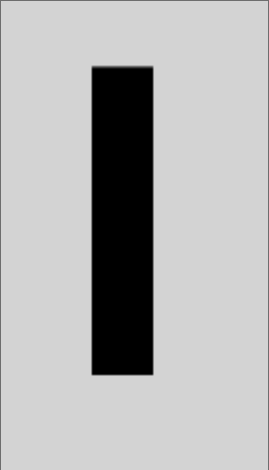

## 起因

最近在一个教程里看到了一个神奇的写法：
```js
const canvas = document.getElementByID("#canvas");
const ctx = canvas.getContext("2d");

function animate() {
    // Draw Rect
    let x = 100;
    let y = 100;

    y -= 1;

    ctx.rect(x, y, 30, 60);
    ctx.fill();

    requestAnimationFrame( animate );
}

requestAnimationFrame( animate );
```

代码很简单，就是在Canvas上画一个矩形，每帧画面向上移动1px

用过canvas的朋友们应该知道，背景没有重绘，移动物体就会留下长长的移动轨迹

{{}}

正常来说，要解决这个问题，要需要在animte中添加clearRect并且在rect前添加beginPath即可

但教程作者只在animate中添加了一句，就解决了所有问题
```js
canvas.width = 200
```

## 为什么?

很显然，设置Canvas的大小会清空画面，但这是为什么呢？

在[spec](https://html.spec.whatwg.org/multipage/canvas.html#the-canvas-element:attr-canvas-width-5)中可以看到，如果Context Mode是2D的话，设置width或height时需要执行：

1. [Reset the rendering context to its default state.](https://html.spec.whatwg.org/multipage/canvas.html#reset-the-rendering-context-to-its-default-state)
2. Resize the output bitmap to the new width and height.

而在第1步中，就包含这下面几条命令

1. Clear canvas's bitmap to transparent black.
2. Empty the list of subpaths in context's current default path.
3. Clear the context's drawing state stack.
4. Reset everything that drawing state consists of to their initial values.

所以，设置width或height会把canvas设置回最初的状态。

<del>那，这个特性有什么用吗？目前还没发现。</del>
重新设置width或height会清除一切state, transform, lineWidth, strokeStyle 等等
如果在特殊情况下需要重置的话，可以使用这个方法。

正常来说清Canvas画布还是用：
```js
// Store the current transformation matrix
context.save();

// Use the identity matrix while clearing the canvas
context.setTransform(1, 0, 0, 1, 0, 0);
context.clearRect(0, 0, canvas.width, canvas.height);

// Restore the transform
context.restore();
```
