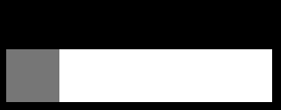

# 0x00 前因
前段时间在[这里](https://www.zhangxinxu.com/wordpress/2017/12/svg-filter-fuse-gooey-effect/) 看到了下图的效果，感觉非常奇妙。该效果的实现主要用到了SVG Filter的知识，本文旨在探索涉及到的滤镜知识。

{{}}

```html
<svg width="0" height="0">
  <defs>
    <filter id="goo">
      <feGaussianBlur in="SourceGraphic" stdDeviation="10" result="blur" />
      <feColorMatrix in="blur" mode="matrix" values="1 0 0 0 0
                                                     0 1 0 0 0
                                                     0 0 1 0 0
                                                     0 0 0 19 -9" result="goo" />
      <feComposite in="SourceGraphic" in2="goo" operator="atop"/>
    </filter>
  </defs>
</svg>
```

# 0x01 feGaussianBlur

Filter Effect Gaussian Blur (高斯模糊滤镜效果)，`stdDeviation` 控制模糊的大小。[result](https://developer.mozilla.org/en-US/docs/Web/SVG/Attribute/result) 参数给当前效果起一个名字，可以在其它滤镜中继续引用。

{{}} 
{{}} 

# 0x02 feColorMatrix
[Filter Effect Color Matrix (色彩矩阵滤镜效果)](https://developer.mozilla.org/en-US/docs/Web/SVG/Element/feColorMatrix)，该滤镜将所有点的`RGBA值`与给定的矩阵相乘。

{{}} 

```
// matrix
1 0 0  0  0
0 1 0  0  0
0 0 1  0  0
0 0 0 19 -9

R' = 1*R + 0*G + 0*B + 0*A + 0 = R
G' = 0*R + 1*G + 0*B + 0*A + 0 = G
B' = 0*R + 0*G + 1*B + 0*A + 0 = B
A' = 0*R + 0*G + 0*B + 19*A - 9 = 19A - 9
```

代入矩阵后能看出来，经过`Color Matrix`，`RGB`都没有变化，只有`A'`变成了`19A - 9`

那么`19A - 9`到底是什么意思呢？(此段论述由推测得出，有一定猜测因素，不确保正确)

{{}} 
{{}} 
{{}} 

从上面图片和代码来看，我们能得出一个结论：`19A - 9` 让所有`a`小于`0.5`的地方都完全透明，所有大于`0.5`的地方都完全**不透明**，等于`0.5`的地方保持不变。即，提高透明值的对比度。

# 0x03 feComposite

{{}} 

可以看到粘连的效果已经出来了，可是上面的字和图标因为高斯模糊都看不见了。所以需要使用`feComposite`把原本的样子叠在上面。

`<feComposite in="SourceGraphic" in2="goo" operator="atop">`

# 0xFF 更多阅读
+ [小tips: 0学习成本实现HTML元素粘滞融合效果](https://www.zhangxinxu.com/wordpress/2017/12/svg-filter-fuse-gooey-effect/)
+ [The Gooey Effect](https://css-tricks.com/gooey-effect/)
